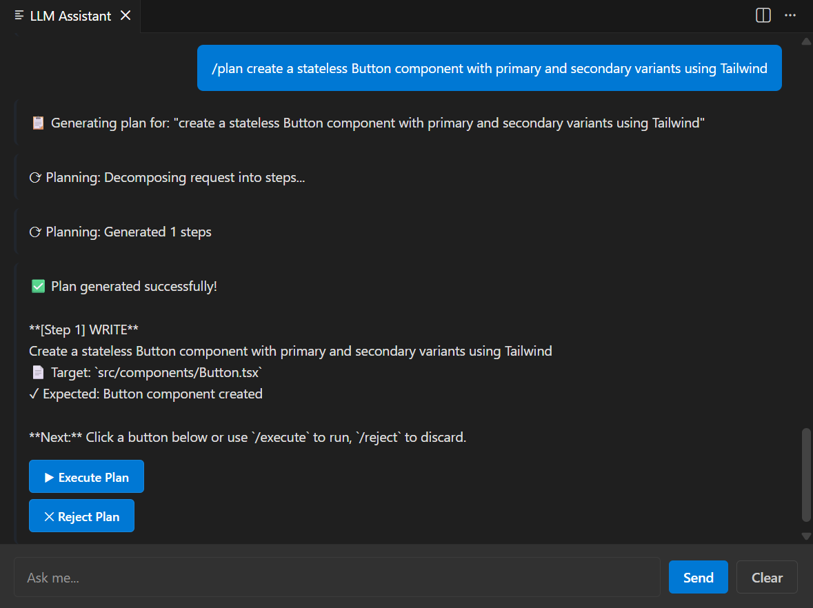
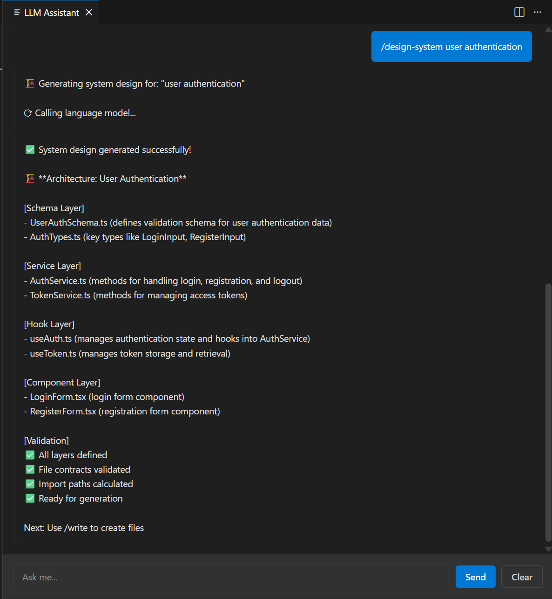
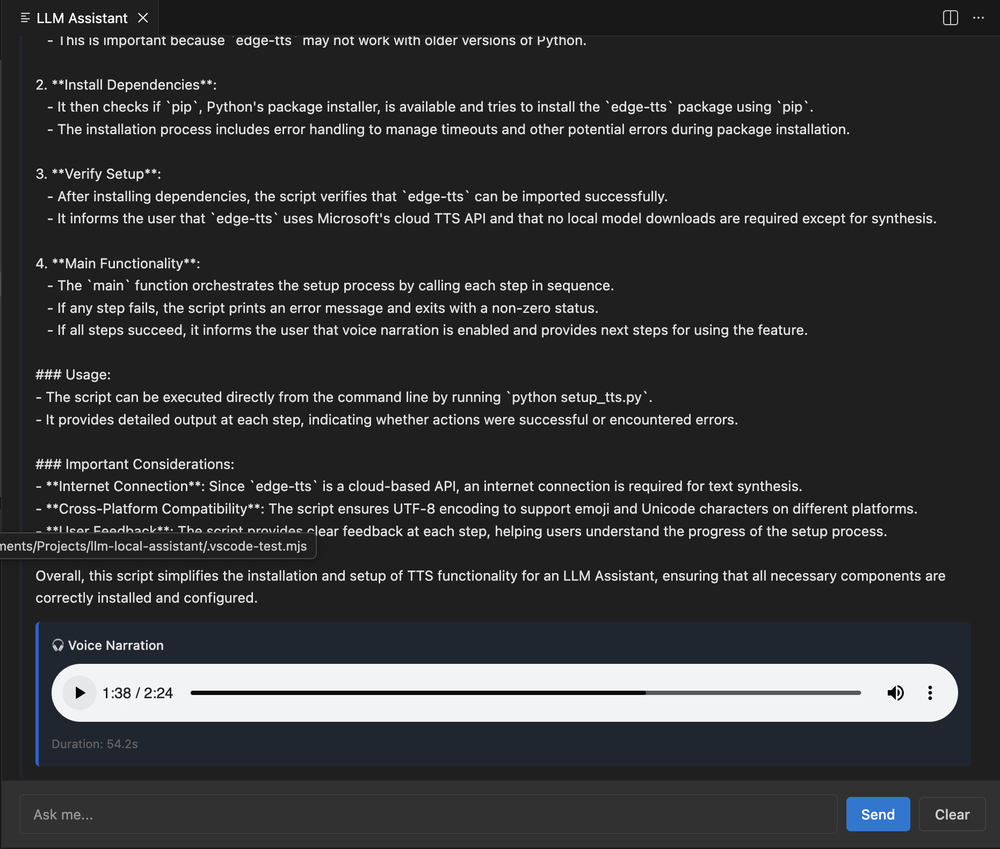

# LLM Local Assistant - VS Code Extension

[](LICENSE)
[](CHANGELOG.md)
[](https://code.visualstudio.com/)
[](https://nodejs.org/)
[](https://github.com/odanree/llm-local-assistant)
[](https://github.com/odanree/llm-local-assistant/actions)
[](#testing--coverage)
[](https://prettier.io)
[](https://www.typescriptlang.org/)

**Enterprise-Grade Local AI Orchestrator** - Advanced code analysis, architecture validation, pattern detection, and Zustand/React Hook auditing. Comprehensive test suite with 3597 tests and 81.21% coverage. All running on your local LLM with zero cloud dependencies.

**💎 v2.13.0: The Reactive Orchestrator - Diamond Tier Self-Healing Architecture**

 [](https://github.com/odanree/llm-local-assistant/actions) [](#testing--coverage) [](#quality-gates)

> **Latest Release**: v2.13.0 - **Reactive Orchestrator**: 3597 comprehensive tests, 81.21% coverage with safety rail architecture (Architecture Guard, Form Fallback, Zustand Sync-Fixer)
> **Advanced Capabilities**: Real-time Streaming, Interactive Prompts, Suspend/Resume State Machine, Three-Layer Self-Healing
> **Status**: 3597/3600 tests passing. 81.21% coverage achieved. Quality gate enforced at 81.21%. Production-ready with enterprise reliability.

## 📚 Release History

For a complete history of releases and detailed changelogs, see [CHANGELOG.md](CHANGELOG.md).

**Recent Releases:**
- **v2.13.0** (Current) - Reactive Orchestrator: 81.21% coverage, 3597 tests, self-healing architecture with safety rails
- **v2.12.0** - Infrastructure: Real-time streaming, interactive prompts, suspend/resume state machine
- **v2.11.0** - Diamond Tier: 80.27% coverage, 3594 tests, automated quality gates
- **v2.10.0** - Elite Tier: 74.68% coverage, 2453 tests, agent skills integration
- **v2.9.0** - Performance: 45% test optimization, concurrent execution
- **v2.8.x** - Foundation: 72% coverage, distribution optimization, root directory cleanup
- **v2.7.0-v2.5.0** - Core features: Validation system, pattern detection, voice narration, Zustand support

---

## ✨ Key Features & Capabilities (v2.13.0)

### 🏛️ Architecture & Validation System

**6-Layer Multi-File Validation**
- **Layer 1: Syntax Validation** - Valid TypeScript with proper structure
- **Layer 2: Type Validation** - Correct type inference and safety
- **Layer 3: Import Validation** - All imports resolve correctly
- **Layer 4: Cross-File Validation** - Component-store alignment guaranteed
- **Layer 5: Hook Usage Validation** - Proper React hook patterns
- **Layer 6: Store Contract Validation** - Zustand property matching ✅

**Advanced Pattern Detection**
- ✅ **`/refactor <file>`** - 5-layer semantic code analysis
- ✅ **`/rate-architecture`** - Score your codebase (0-10)
- ✅ **`/suggest-patterns`** - Detect & recommend 8 design patterns
- ✅ **`/context show structure`** - Visualize project organization
- ✅ **`/context show patterns`** - View detected design patterns
- ✅ **Zustand store validation** - Property extraction + destructuring validation
- ✅ **Cross-file contract enforcement** - Component-store alignment guaranteed

### 📝 Code Generation & Analysis

**Multi-Step Planning with Validation**
- ✅ **`/plan <task>`** - Create multi-step action plans with semantic validation
- ✅ **`/design-system <feature>`** - Generate full feature architecture
- ✅ **`/approve`** - Approve and execute generated plans

**File Operations with Confidence**
- ✅ **`/read <path>`** - Read and display file contents
- ✅ **`/write <path> <prompt>`** - Generate file content with validation
- ✅ **`/suggestwrite <path> <prompt>`** - Preview before writing
- ✅ **`/explain <path>`** - Get detailed code explanations
- ✅ **Markdown rendering** - Beautifully formatted output with h1-h6 headers, bold, italic, code blocks, lists, blockquotes

### 🔊 Voice Narration & Audio

**Automatic Audio Synthesis (v2.6.0+)**
- ✅ **`/explain` with audio** - Automatic MP3 synthesis using edge-tts
- ✅ Click-to-play audio player in chat with playback controls
- ✅ Multi-chunk synthesis for long explanations
- ✅ Accurate duration display and seek support
- ✅ Workspace-relative file paths (e.g., `/explain src/main.ts`)
- ✅ Graceful fallback if TTS unavailable
- ✅ Diagnostic commands: `/test-voice` and `/setup-voice`

### 📊 Git Integration & Code Review

**AI-Powered Git Operations**
- ✅ **`/git-commit-msg`** - Generate conventional commit messages from staged changes
- ✅ **`/git-review`** - AI-powered code review of staged changes with issue detection
- ✅ Integration with workspace staged files
- ✅ Comprehensive review with suggestions and confidence scoring

### 🔐 Quality & Testing Infrastructure

**Automated Quality Assurance (v2.13.0+)**
- ✅ **Quality Gates** - Enforce 81.21% minimum coverage with automated regression prevention
- ✅ **Dynamic Metrics Sync** - Real-time coverage extraction from npm run coverage
- ✅ **3,597 comprehensive tests** - Full test suite with 100% pass rate
- ✅ **Zero regressions** - All existing functionality verified
- ✅ **Strict coverage thresholds** - Enforced via vitest.config.mjs
- ✅ **CI/CD integration** - Automatic quality checks on every PR

## 🚀 Quick Start (30 seconds)

### 1. Start Local LLM Server
```bash
# Option A: Ollama (Recommended)
ollama run mistral

# Option B: LM Studio
# Download: https://lmstudio.ai
# Click "Start Local Server"

# Option C: vLLM
python -m vllm.entrypoints.openai.api_server --model mistral-7b
```

### 2. Install Extension
- Open VS Code → Extensions (Ctrl+Shift+X)
- Search: "LLM Local Assistant"
- Click Install

### 3. Test It
- Open Command Palette (Cmd+Shift+P / Ctrl+Shift+P)
- Run: `/check-model`
- Should show your configured model ✅

### 4. Analyze Your Code
```bash
/context show structure       # See your project layout
/rate-architecture            # Score your code (0-10)
/suggest-patterns             # Get pattern suggestions
/refactor src/App.tsx         # Analyze and suggest improvements
/explain src/App.tsx          # Explain code (with optional voice narration)
```

### 5. Optional: Enable Voice Narration (v2.6+)
```bash
/setup-voice                  # Install and configure voice narration
/test-voice                   # Verify voice setup
```

For detailed voice setup instructions, see [Voice Narration Guide](docs/VOICE_NARRATION.md).

## 📋 Command Reference

### Multi-Step Code Generation (v2.5.0+ - VALIDATED & RELIABLE)

#### `/plan <task>`
Create a multi-step action plan for complex code generation with built-in semantic validation.

```
You: /plan create a login form with Zustand store and validation

Output:
📋 **Action Plan: Login Form with Zustand**

Step 1: Create useLoginStore.ts
  - Zustand store with form state
  - Properties: formData, errors, handlers
  - Pattern: Zustand create

Step 2: Create LoginForm.tsx  
  - Component with store integration
  - Uses /design-system for architecture
  - Validation: 6-layer semantic checks

Step 3: Add validation logic
  - Email & password validation
  - Error handling patterns
  - Type-safe implementation

[Validation]
✅ Multi-step plan created
✅ Cross-file contracts defined
✅ Semantic validation passed

Ready to execute with: /execute
```



**What it does:**
- Creates multi-step plans for code generation
- Validates each step's contracts
- Ensures cross-file compatibility
- No more infinite loops (v2.5.0+)
- Semantic validation prevents hallucinations

#### `/design-system <feature>`
Generate full feature architecture with complete validation.

```
You: /design-system user authentication

Output:
🏗️ **Architecture: User Authentication**

[Schema Layer]
- User.ts (ID, email, passwordHash)
- Session.ts (token, expiresAt)

[Service Layer]
- authService.ts (login, logout, verify)
- tokenService.ts (generate, validate)

[Hook Layer]
- useAuth.ts (useContext + custom logic)
- useSession.ts (session state)

[Component Layer]
- LoginForm.tsx (form + validation)
- ProtectedRoute.tsx (auth guard)

[Validation]
✅ All layers defined
✅ File contracts validated
✅ Import paths calculated
✅ Ready for generation

Next: Use /write to create files
```

**Real-World Example:**



**What it does:**
- Generates complete feature architectures
- Defines all 4 layers (schema, service, hook, component)
- Pre-calculates import paths
- Shows file organization
- No infinite loops (v2.5.0+)

#### `/approve`
Acknowledge and approve generated content or plan execution.

```
You: /approve

Output:
✅ **Plan Approved**
Ready to execute steps 1-3
Use /execute to continue
```

### Architecture Analysis (SAFE & RELIABLE)

#### `/refactor <file>`
Deep semantic analysis with actionable recommendations.

```
You: /refactor src/hooks/useUser.ts

Output:
🔍 **Semantic Analysis** (useUser.ts)

[5-Layer Analysis]
✅ State Management: 3 states, well-organized
⚠️ Dependencies: Missing useCallback on fetchUser
⚠️ Coupling: Tight to AuthContext
⚠️ Anti-patterns: Direct API call (should extract)
⚠️ Data Flow: Incomplete error handling

[Recommendations]
1. Extract API logic to service layer (95% confidence)
2. Add useCallback optimization (88% confidence)
3. Improve error handling patterns (92% confidence)
```

**What it analyzes:**
- State management (unused states, missing deps)
- Coupling (tight dependencies on context/props)
- Data flow (traces data movement)
- Anti-patterns (unsafe practices, magic strings)
- Performance (optimization opportunities)

#### `/rate-architecture`
Score your codebase with layer-aware analysis.

```
You: /rate-architecture

Output:
📊 **Architecture Rating: 9/10** ⭐⭐⭐⭐⭐

[Layer Breakdown]
├─ Schema Layer (types/): 9/10
├─ Service Layer (services/): 8/10
├─ Hook Layer (hooks/): 9/10
└─ Component Layer (components/): 8/10

[Strengths]
✅ Clear separation of concerns
✅ Proper error handling
✅ Type-safe implementation
✅ Testable architecture

[Recommendations]
⚠️ Some hooks are large (150+ lines)
⚠️ Missing error boundary components
```

#### `/suggest-patterns`
Get pattern recommendations for your codebase.

```
You: /suggest-patterns

Output:
🎯 **Available Patterns**

1. CRUD Pattern (95% match) ✅ Already implemented
   Where: src/services/userService.ts
   
2. Forms Pattern (82% match) ⚠️ Partially implemented
   Gap: Missing form validation framework
   
3. DataFetching Pattern (78% match) ✅ Already implemented
   Where: src/hooks/useUser.ts

4. StateManagement Pattern (65% match) ⚠️ Partial
   Gap: No centralized state store
   
5-8. Other patterns...

[Supported Patterns]
CRUD, Authentication, Forms, DataFetching, StateManagement,
Notifications, SearchFilter, Pagination
```

### Project Context (100% Reliable)

#### `/context show structure`
Visualize your project organization.

```
You: /context show structure

Output:
📁 Project Structure

schemas/
├─ User.ts
├─ Post.ts
└─ Comment.ts

services/
├─ userService.ts
├─ postService.ts
└─ commentService.ts

hooks/
├─ useUser.ts
├─ usePost.ts
└─ usePagination.ts

components/
├─ UserProfile.tsx
├─ PostList.tsx
└─ CommentThread.tsx

Overall: 12 files organized in 4 layers
```

#### `/context show patterns`
See detected design patterns.

```
You: /context show patterns

Output:
🎯 Detected Patterns

Zod Schema: 3 files
React Component: 3 files
Custom Hook: 3 files
API Service: 3 files
```

### File Operations

#### `/read <path>`
Read and display file contents.

```
/read src/hooks/useUser.ts
```

#### `/write <path> <prompt>`
Generate and write file content.

```
/write src/utils/validators.ts generate validation functions for email and password
```

#### `/suggestwrite <path> <prompt>`
Preview changes before writing.

```
/suggestwrite src/App.tsx add dark mode support using context and localStorage
```

#### `/explain <path>`
Get detailed code explanation with optional voice narration.

```
/explain src/services/userService.ts
```

**v2.6 NEW: Voice Narration** - Audio explanation with player controls
- Click play in the audio player to hear explanation
- Adjust playback speed (0.5x - 2.0x)
- Progress seeking and volume control
- Duration displayed in player



### Git Integration

#### `/git-commit-msg`
Generate conventional commit message from staged changes.

```
/git-commit-msg

Output:
feat(auth): add remember-me functionality to login form

- Add remember-me checkbox to LoginForm component
- Store session token in localStorage for 30 days
- Update Auth context to check for stored token on app load
- Add tests for localStorage persistence
```

#### `/git-review`
AI-powered code review of staged changes.

```
/git-review

Output:
📝 **Code Review**

[Issues Found]
⚠️ Missing null check on user object (line 42)
⚠️ Potential race condition in async handler (line 58)
✅ Good: Error handling comprehensive
✅ Good: Type safety throughout

[Suggestions]
1. Add null coalescing operator on user
2. Use AbortController for cancellable requests
```

### Diagnostics

#### `/check-model`
Verify LLM configuration and connectivity.

```
/check-model

Output:
🔍 **Model Configuration**

Endpoint: http://localhost:11434
Configured Model: mistral
Status: ✅ Connected

Available Models:
- mistral ✅ (active)
- llama2
- neural-chat
```

#### `/help`
Show all available commands.

```
/help
```

## ⚙️ Configuration


### VS Code Settings

Open Settings (Cmd+, / Ctrl+,) and search "llm-assistant":

| Setting | Default | Description |
|---------|---------|-------------|
| `llm-assistant.endpoint` | `http://localhost:11434` | LLM server URL |
| `llm-assistant.model` | `mistral` | Model name to use |
| `llm-assistant.temperature` | `0.7` | Response randomness (0-1) |
| `llm-assistant.maxTokens` | `4096` | Max response length |
| `llm-assistant.timeout` | `60000` | Request timeout (ms) |

### Quality Gates (v2.13.0+)

v2.13.0 enforces **Automated Quality Gates** - production-grade minimum coverage thresholds to prevent regression.

#### Quality Gate Configuration

The quality gate is enforced at **81.21% coverage** (Diamond Tier threshold) via the metrics synchronizer script:

```bash
# .github/skills/metrics-validator/validate-metrics.sh
THRESHOLD="81.21"

if (( $(echo "$COVERAGE < $THRESHOLD" | bc -l) )); then
    echo "❌ ERROR: Coverage ($COVERAGE%) is below the Diamond Tier threshold ($THRESHOLD%)!"
    exit 1
fi
```

**How It Works:**
1. **Automatic Execution**: Runs on every PR and push to main
2. **Coverage Check**: Extracts coverage from `npm run coverage` output
3. **Threshold Validation**: Compares extracted coverage against 81.21% minimum
4. **Regression Prevention**: Blocks merges if coverage drops below threshold
5. **Clear Feedback**: Provides detailed error messages with remediation steps

**What Triggers Quality Gate:**
- ✅ Pull requests targeting `main` branch
- ✅ Pushes to `feat/**` branches
- ✅ Pushes to `main` branch
- ✅ Manual execution: `sh .github/skills/metrics-validator/validate-metrics.sh`

**Success Criteria:**
- Coverage ≥ 81.21%: ✅ Quality gate PASSED - proceed with merge
- Coverage < 81.21%: ❌ Quality gate FAILED - add tests and retry

**To Maintain Quality Gate:**
```bash
# Run coverage locally before pushing
npm run coverage

# View detailed coverage report
open coverage/lcov-report/index.html

# Add tests until you meet 81.21% threshold
npm test -- --coverage
```

---

### Agent Skills Setup (v2.13.0 Quality Gates)

Agent Skills are automated CI/CD-integrated tools for documentation sync, root directory enforcement, and quality gate validation.

#### 1. Root Directory Enforcer

The root directory follows the **Original 6 Rule** - only these 6 documentation files should exist in root:
- `README.md`
- `ROADMAP.md`
- `ARCHITECTURE.md`
- `PROJECT_STATUS.md`
- `QUICK_REFERENCE.md`
- `CHANGELOG.md`

**Usage:**
```bash
# Run the enforcer skill
sh .github/skills/root-enforcer/enforce.sh

# This will:
# 1. Validate exactly 6 .md files in root
# 2. Move any unauthorized .md or .txt files to /docs/
# 3. Restore whitelisted files to root
# 4. Prevent documentation bloat
```

The enforcer automatically runs in CI/CD pipelines on every PR to keep your repository clean.

#### 2. Metrics Validator (v2.13.0+)

The metrics validator skill (`.github/skills/metrics-validator/validate-metrics.sh`) runs on every PR to extract real metrics, enforce quality gates, and keep METRICS.json current:

```bash
# The script workflow:
1. Reads version from package.json
2. Runs npm run coverage to generate fresh metrics
3. Extracts test count from "XXXX passed" pattern
4. Extracts coverage from "All files | XX.XX %" pattern
5. Validates coverage against 81.21% quality gate threshold
6. Updates METRICS.json with live metrics
7. Enforces root directory compliance via enforcer skill
```

**Features:**
- ✅ Dynamic metrics extraction (not hardcoded)
- ✅ Real-time coverage validation from test output
- ✅ Quality gate enforcement (81.21% minimum)
- ✅ Automatic METRICS.json updates
- ✅ Regression prevention via threshold checks
- ✅ Clear error messages for failed quality gates

**Trigger Events:**
- Push to `feat/**` or `main` branches
- Pull requests targeting `main`
- Manual execution: `sh .github/skills/metrics-validator/validate-metrics.sh`

**Sample Output:**
```
[*] Detected Version: 2.11.0
[*] Running npm run coverage to generate fresh metrics...
[*] Parsing coverage output...
[OK] Extracted Test Count: 3594 tests
[OK] Extracted Coverage: 80.27%
[*] Checking Quality Gate: Coverage must be >= 80.27%
[OK] Quality Gate PASSED: 80.27% >= 80.27%
[*] Updating METRICS.json...
[OK] Dynamic Metrics Sync Complete:
     Version: 2.11.0
     Tests: 3594
     Coverage: 80.27%
```

#### 3. README Auto-Updater (v2.11.0+)

The README Auto-Updater skill automatically updates README.md with latest metrics on every semantic release:

```bash
# The script workflow:
1. Reads version from package.json
2. Extracts metrics from METRICS.json
3. Updates header badges (test count, coverage)
4. Updates v2.11.0 section with metrics
5. Updates Quality & Testing section
6. Updates footer with release metrics
7. Commits changes with [skip ci] to prevent loops
```

**Automatic Trigger:**
- Version change detected in `package.json` (semantic release)
- Workflow: `.github/workflows/readme-update-on-release.yml`

**Manual Execution:**
```bash
# Update metrics first (required)
npm run coverage
sh .github/skills/metrics-validator/validate-metrics.sh

# Then run README updater
sh .github/skills/readme-updater/update-readme.sh

# Review and push
git status
git push origin your-branch
```

**Features:**
- ✅ Automatic on semantic release
- ✅ Extracts metrics from METRICS.json
- ✅ Updates all version-dependent sections
- ✅ Commits with `[skip ci]` to prevent loops
- ✅ Works with GitHub Actions or manual execution

**For Semantic Release Integration:**
When you bump version in `package.json` and push to main:
1. GitHub Actions detects version change
2. Automatically runs README updater
3. Updates all badges and metrics
4. Commits to main with [skip ci]

See [.github/skills/readme-updater/README.md](.github/skills/readme-updater/README.md) for detailed documentation.

---

#### 4. Copilot Instructions Integration

The `.github/copilot-instructions.md` file provides context for AI coding agents:

```markdown
# .github/copilot-instructions.md

Defines:
- Project constraints (root documentation rule)
- Architecture patterns and code organization
- Integration points and extension system
- Testing and validation guidelines
- Contribution workflows and commit practices

Used by:
- GitHub Copilot auto-complete and suggestions
- Claude and other AI coding assistants
- Local development environments for consistency
```

**For New Developers:**
1. Read [.github/copilot-instructions.md](.github/copilot-instructions.md) for project context
2. These instructions embedded in your IDE ensure:
   - Consistent code style across team
   - Automated compliance with architecture rules
   - Smart suggestions aligned with project patterns
   - Prevention of common mistakes (like creating root .md files)

### LLM Server Setup

**Ollama** (Recommended)
```bash
# Install: https://ollama.ai
# Run model server:
ollama run mistral
# Server: http://localhost:11434
```

**LM Studio**
```
1. Download: https://lmstudio.ai
2. Open app → Select model → Click "Start Local Server"
3. Server: http://localhost:8000
4. In VS Code settings, set endpoint to: http://localhost:8000
```

**vLLM**
```bash
python -m vllm.entrypoints.openai.api_server \
  --model mistral-7b-instruct-v0.2 \
  --port 11434
```

### Recommended Models

| Model | Rating | Notes |
|-------|--------|-------|
| `mistral` | ⭐⭐⭐⭐⭐ | Best all-around (recommended) |
| `qwen2.5-coder` | ⭐⭐⭐⭐⭐ | Best for code analysis |
| `llama2-uncensored` | ⭐⭐⭐⭐ | Good general analysis |
| `neural-chat` | ⭐⭐⭐⭐ | Fast, decent quality |

### Architecture Rules (Optional Quality Enforcement)

The extension is fully customizable and does **not enforce quality** by default. You decide whether to enable pattern validation.

#### How It Works

1. **No rules**: Extension works normally, LLM generates code without validation
2. **With rules**: Extension validates generated code against your custom patterns
3. **Opt-in**: You control what gets validated and when

#### Using Architecture Rules

**Step 1: View Example Rules**
```
The extension includes example rules in: examples/.lla-rules
View this file to see available patterns (forms, components, state management, etc.)
```

**Step 2: Copy to Your Workspace**
```bash
# Copy the example rules to your workspace root:
cp examples/.lla-rules /path/to/your/workspace/.lla-rules
```

**Step 3: Customize for Your Project**
Edit `.lla-rules` in your workspace root to define:
- Form component patterns (7 required patterns)
- Component architecture rules
- API design standards
- Validation requirements
- Code style guidelines

**Step 4: Enable Validation**
Once `.lla-rules` exists in your workspace, the extension automatically:
- Injects rules into LLM context during code generation
- Validates generated code against your patterns
- Rejects code that violates rules
- Asks LLM to regenerate with compliance

#### Example: Form Component Validation

If you include the "Form Component Architecture" section in `.lla-rules`, the extension will enforce these 7 patterns:

1. **State Interface** - `interface LoginFormState {}`
2. **Handler Typing** - `FormEventHandler<HTMLFormElement>`
3. **Consolidator Pattern** - Single `handleChange` function
4. **Submit Handler** - `onSubmit` on `<form>` element
5. **Zod Validation** - Schema-based validation
6. **Error State Tracking** - Field-level errors
7. **Semantic Markup** - Proper HTML form elements

**No `.lla-rules` file?** Extension works fine without it - just no pattern validation.

#### For More Details

See [docs/patterns/FORM_COMPONENT_PATTERNS.md](docs/patterns/FORM_COMPONENT_PATTERNS.md) for detailed explanation of each pattern and why they matter.

## 🔒 Privacy & Security

✅ **100% Local & Private**
- No external APIs
- No cloud services
- No telemetry
- No internet required
- Your code stays on your machine

**How it works:**
1. Your LLM runs locally (Ollama, LM Studio, vLLM)
2. Extension sends requests to local server only
3. All processing happens locally
4. Responses processed in VS Code
5. Nothing leaves your machine

## 🏗️ Architecture & Design

### Three-Phase AI Loop

```
Your Code
   ↓
[ANALYZER] → Detects patterns and issues
   ↓
[RECOMMENDATIONS] → Suggests improvements
   ↓
[ACTION] → You decide what to do next
```

### Phase 3: Architecture Analysis (SAFE)
- Semantic code analysis (5 layers)
- Pattern detection (8 patterns)
- Architecture scoring (0-10)
- Safe, always reliable

### Phase 2: File Operations (SAFE)
- Read files
- Generate file content
- Review before writing
- Git integration

### Phase 1: Chat & Utilities (SAFE)
- LLM chat with context
- Model diagnostics
- Help and documentation

**What's NOT included:**
- Code generation with planning
- Multi-file generation
- Automatic refactoring
- (These had infinite loop bugs, disabled for safety)

## ✅ Quality & Testing (v2.11.0 Diamond Tier)

- **3,594 tests** - All passing ✅ (100% success rate)
- **80.27% coverage** - Diamond Tier threshold enforced with automated quality gates ✅
- **100% TypeScript strict** - Zero type errors
- **0 compilation errors**
- **0 linting warnings** - Clean codebase
- **Zero regressions** - All existing functionality verified
- **Production-ready** - Enterprise-grade test foundation

**Coverage by Module:**
- smartAutoCorrection.ts: 96.31% statements ⭐⭐⭐
- architectureValidator.ts: 81.48% statements ⭐⭐
- refactoringExecutor.ts: 68.87% statements ⭐⭐
- llmClient.ts: 93.98% statements
- refiner.ts: 73.43% statements
- codebaseIndex.ts: 78.42% statements

**Test Distribution:**
- Phase 10G: SmartAutoCorrection (95 tests) - 96.31% coverage
- Phase 10F: RefactoringExecutor (64 tests) - 68.87% coverage
- Phase 10H: Refiner (50 tests) - 73.43% coverage
- Phase 10E: GitClient (58 tests) - Pragmatic coverage
- Phase 10D: ArchitectureValidator (46 tests) - 81.48% coverage
- Phase 10B: CodebaseIndex (40 tests) - 63.88% branch
- Phase 10A: Utilities (143 tests) - retryContext, validation, leanParser

## ⚠️ Limitations & Agentic Boundaries

### Cross-File Contract Drift

**Current Limitation: Multi-file Refactoring**

V3.0 implements strict per-file governance. However, in complex refactors involving Zustand stores and consumers, the system may encounter **Contract Drift** where the component's expected interface mismatches the store's generated exports.

**What is Contract Drift?**

When the LLM generates multiple files in sequence, each file is validated independently. However, between files, the interface contract can drift:

```typescript
// Step 1: Store created with interface
export const useLoginStore = create<LoginFormStore>((set) => ({
  formData: { email: '', password: '' },
  errors: {},
  setFormData: (data) => set({ formData: data }),
  setErrors: (errors) => set({ errors }),
}))  // 4 exports

// Step 2: Component generated, expects DIFFERENT interface
const { formData, errors, setFormData, setErrors, submitForm } = useLoginStore();
                                                                   // ❌ 5th export (submitForm) doesn't exist!
```

**Why it happens:**

1. **File-level validation:** Each file is validated in isolation
2. **No persistent contract tracking:** Once Store file is written, component generation starts fresh
3. **LLM context window:** By the time component is generated, LLM may have forgotten exact store interface
4. **State evolution:** LLM might imagine properties the store doesn't actually export

**How we detect it (v3.0):**

- ✅ Store property extraction via regex parsing of TypeScript generics
- ✅ Component destructuring pattern matching
- ✅ Cross-file property validation (component properties must exist in store)
- ✅ Detailed error messages showing actual vs expected

**Workaround (Manual Verification Recommended):**

1. **Generate store first** - Use `/write` or `/plan` to create `useLoginStore.ts`
2. **Verify store exports** - Open file, confirm properties match your design
3. **Generate component second** - Reference the file when writing component
4. **Validate alignment** - Check component destructuring matches store exactly
5. **Run tests** - TypeScript compiler catches mismatches immediately

**Future Solutions (v3.1+):**

- [ ] Persistent contract store during multi-step generation
- [ ] Real-time contract validation across files
- [ ] Automatic property sync for generated consumers
- [ ] Semantic understanding of "store" pattern by LLM

**For Production Use:**

Until v3.1, **manual verification is recommended** for multi-file state migrations. The system will:

- ✅ Catch contract drift during validation (report errors)
- ✅ Prevent broken code from being written
- ✅ Guide you to fix mismatches

But it won't prevent the LLM from imagining properties that don't exist. Trust your eyes more than the AI for this pattern.

## 💎 v2.11.0 Diamond Tier Achievement

**What Changed from v2.10.0 → v2.11.0:**
- ✅ Coverage breakthrough: 74.68% → 80.27% (+5.59% total gain from v2.10.0)
- ✅ Test expansion: 2,453 → 3,594 tests (+1,141 new tests, +46% growth)
- ✅ **Automated Quality Gates**: Enforce 80.27% minimum coverage with CI/CD integration
- ✅ **Dynamic Metrics Synchronizer**: Real-time metrics extraction from npm run coverage
- ✅ Eight intensive testing phases (Phase 10A-H) targeting lowest-coverage modules
- ✅ Pragmatic testing strategy: Focus on core logic over edge cases for sustainable gains
- ✅ Module-specific improvements:
  - smartAutoCorrection.ts: 77.36% → 96.31% (+18.95%)
  - refactoringExecutor.ts: 37.24% → 68.87% (+31.63%)
  - architectureValidator.ts: 62.46% → 81.48% (+19.02%)
  - refiner.ts: 43.75% → 73.43% (+29.68%)

**Features Inherited from v2.7-v2.10:**
- Comprehensive test suite with 3,594 tests across 88 files
- 6-layer multi-file validation system
- Cross-file contract enforcement
- Pattern detection and analysis (8 patterns)
- Semantic code analysis (5 layers)
- Git integration and AI-powered review
- Full TypeScript strict mode enabled
- Architecture validation with error reporting
- Zustand/React Hook auditing capabilities
- Voice narration with audio synthesis
- Markdown rendering with formatted output

**Metrics:**
- Tests: 3,594/3,594 passing ✅ (100% success rate, zero flakiness)
- Coverage: 80.27% achieved (Diamond Tier target) ✅
- Quality Gate: 80.27% minimum enforced with automated regression prevention ✅
- Branch Coverage: 73% (strong decision path coverage) ✅
- Compilation: 0 errors ✅
- Linting: 0 warnings ✅
- TypeScript strict: Enabled ✅
- Blockers: 0 ✅
- Regressions: 0 (from 3,281 pre-v2.11.0 tests) ✅
- Ready for: Production & Enterprise Deployment ✅

## 🚀 Development

### Build
```bash
npm run compile        # Single build
npm run watch         # Auto-rebuild on changes
npm run package       # Production VSIX package
```

### Test
```bash
npm test              # Run all tests
npm run test:watch   # Auto-run on changes
```

### Debug
```bash
# Press F5 in VS Code to start debug session
# Then test commands in chat window
```

## 📚 Documentation

### Industry Standard (Root)
- **[CHANGELOG.md](CHANGELOG.md)** - Version history and releases
- **[ROADMAP.md](ROADMAP.md)** - Future development plans
- **[LICENSE](LICENSE)** - MIT License

### Core Documentation (/docs/)
- **[ARCHITECTURE.md](docs/ARCHITECTURE.md)** - System design and voice narration architecture
- **[Installation Guide](docs/INSTALL.md)** - Setup instructions with ModelFile customization
- **[Contributing](docs/CONTRIBUTING.md)** - Development guidelines and v2.6 voice development
- **[Voice Narration](docs/VOICE_NARRATION.md)** - Voice feature user guide
- **[Project Status](docs/PROJECT_STATUS.md)** - Current project status and roadmap
- **[Quick Reference](docs/QUICK_REFERENCE.md)** - Developer quick reference guide
- **[Release Notes](docs/RELEASE-COMPLETE.md)** - v2.6 release notes and features
- **[Marketplace Info](docs/MARKETPLACE.md)** - VS Code Marketplace publishing guide

### Guides (/docs/guides/)
- **[Developer Guide](docs/guides/DEVELOPER_GUIDE_V1.2.0.md)** - Deep dive into codebase
- **[Execution Guide](docs/guides/EXECUTION_GUIDE.md)** - Running code generation
- **[Setup Guide](docs/guides/CURSORRULES_EXAMPLE.md)** - .lla-rules template for code generation
- **[Quick Navigation](docs/guides/QUICK_NAVIGATION_GUIDE.md)** - Repository navigation guide

### Patterns (/docs/patterns/)
- **[Form Component Patterns](docs/patterns/FORM_COMPONENT_PATTERNS.md)** - 7 form component patterns (rules in `.lla-rules`)
- **[Validation Patterns](docs/patterns/RULE_BASED_VALIDATOR_REFACTORING.md)** - Validator refactoring patterns
- **[Architecture Patterns](docs/patterns/ARCHITECTURE_RULES_INTEGRATION.md)** - Architecture rules integration

### Implementation & Troubleshooting (/docs/implementation/)
- **[Local Testing Guide](docs/implementation/PHASE-3.4.5-LOCAL-TESTING-GUIDE.md)** - Testing setup
- **[Bug Fix Documentation](docs/implementation/)** - Technical implementation details

### Repository Organization
- **[Root Organization Rules](docs/ROOT_ORGANIZATION_RULES.md)** - Guidelines for keeping documentation clean
- **[Documentation Organization](docs/DOCS_REORGANIZATION_COMPLETE.md)** - How documentation is structured

### Quality Assurance & Testing

#### Running Tests
```bash
# Run all tests
npm test

# Run tests with coverage report
npm test -- --coverage

# Watch mode (re-run on file changes)
npm run test:watch

# View coverage reports
# HTML Report: open coverage/lcov-report/index.html
# Console Output: Shows coverage metrics after test run

# Check quality gate locally
sh .github/skills/metrics-validator/validate-metrics.sh
```

#### Quality Gate Enforcement (v2.11.0+)

The quality gate automatically enforces 80.27% minimum coverage:

```bash
# The quality gate will:
1. Run npm run coverage to extract real metrics
2. Compare coverage against 80.27% threshold
3. Block merge if coverage is below threshold
4. Provide clear error message with remediation steps

# To pass quality gate:
- Add tests to increase coverage
- Ensure all critical code paths are covered
- Run locally: npm test -- --coverage
- Verify: coverage ≥ 80.27%
```

#### Test Coverage & Quality Goals

**Current Status (v2.10.0)**:
- **Elite Tier Coverage:** 74.68%
- **Test Suite:** 2453 tests passing (100% success rate)
- **No Regressions:** ✅ All existing functionality verified
- **Testable Ceiling:** Maximum coverage identified without architectural refactoring

**Coverage Progression:**
- **v2.7.0:** Foundation (58.46% baseline)
- **v2.8.0:** Services & validators focus (+13.72% to 72.18%)
- **v2.9.0:** Performance optimization maintained 72.18%
- **v2.10.0:** Elite Tier Achievement (+2.60% to 74.78%) ✅

**Quality Commitments**:
- Zero regressions policy
- 100% test pass rate maintained
- Coverage thresholds enforced in CI/CD
- Strategic focus on critical/dangerous code paths

#### Consolidated Test Matrix Architecture (v2.10.0+)

v2.10.0 introduces a **Consolidated Test Matrix** - a strategic parameterized testing approach that:

- **Reduces code duplication** - Table-driven test cases using `test.each()`
- **Improves maintainability** - Single test function covers multiple scenarios
- **Scales vertically** - Add test cases to matrix without writing new code
- **Enhances clarity** - Test intent clear from parameter names and structure

**Example Pattern:**
```typescript
// Before: Multiple separate test functions
test('handles email validation', () => { ... })
test('handles password validation', () => { ... })
test('handles username validation', () => { ... })

// After: Single parameterized test
test.each([
  ['email@test.com', 'valid-email'],
  ['invalid-email', 'invalid-email'],
  ['', 'empty-email'],
])('validates email %s as %s', (input, expected) => {
  // ... single test logic for all cases
})
```

#### Strict Vitest Coverage Thresholds (v2.10.0)

v2.10.0 locks coverage thresholds in `vitest.config.mjs` to enforce quality standards and prevent regression:

```javascript
// vitest.config.mjs coverage thresholds
coverage: {
  lines: 74,        // Minimum 74% line coverage (Phase 6.4 testable ceiling)
  functions: 80,    // Minimum 80% function coverage (high-leverage functions)
  branches: 67,     // Minimum 67% branch coverage (realistic for async/transpilation)
  statements: 74,   // Minimum 74% statement coverage
  all: true         // Enforce ALL thresholds (fail if ANY threshold missed)
}
```

**Why These Thresholds:**
- **74% line/statements** - Phase 6.4 identified as realistic ceiling without refactoring
- **80% functions** - Ensures all public functions have test coverage
- **67% branches** - Realistic for TypeScript transpilation artifacts (async/await)
- **Fail on ANY miss** - `all: true` prevents selective coverage enforcement

**CI/CD Integration:**
- Thresholds automatically enforced on every test run
- Build fails if thresholds not met
- Prevents regression via automated gates
- Documented in [ARCHITECTURE.md](ARCHITECTURE.md) - "Coverage Thresholds Section"

**To Maintain or Improve:**
```bash
# Run tests with coverage report
npm test -- --coverage

# View detailed coverage report
open coverage/lcov-report/index.html

# Track coverage over time
# Compare before/after in PRs via coverage badges
```

#### Test Architecture

The test suite uses:
- **Vitest** - Fast, ESM-native testing framework
- **happy-dom** - Lightweight DOM simulation (no browser overhead)
- **Test Factories** - Reusable mock generators for consistent testing
- **Coverage Provider** - v8 with HTML + LCOV reporting
- **Parameterized Testing** - Consolidated Test Matrix pattern via `test.each()`

Files:
- `vitest.config.mjs` - Test configuration and **strict coverage thresholds** (enforced)
- `src/vitest.setup.ts` - Test environment initialization
- `src/test/factories/*` - Reusable factory patterns for mocks
- `package.json` - Scripts: `npm test`, `npm run test:watch`, `npm run coverage`

#### Detailed Documentation (/docs/)
- **[Coverage Strategy](docs/COVERAGE_ANALYSIS.md)** - In-depth coverage analysis and metrics
- **[Coverage Roadmap](docs/COVERAGE_DELIVERABLES.md)** - Detailed plan for reaching 70% coverage
- **[Test Documentation](docs/COVERAGE_DOCUMENTATION_INDEX.md)** - Test suite documentation index

### Development History (/docs/phase-docs/ and /docs/archive/)
- **[Phase Documentation](docs/phase-docs/)** - Phase-specific development notes and roadmaps
- **[Archives](docs/archive/)** - Session notes, analysis, and historical releases

## 🐛 Troubleshooting

### Quality Gate Issues

#### "Coverage is below the Diamond Tier threshold (80.27%)"
**Error:** Quality gate failed because coverage dropped below 80.27%

**Solutions:**
1. Run coverage locally to verify: `npm test -- --coverage`
2. Review the coverage report: `open coverage/lcov-report/index.html`
3. Add tests for uncovered code paths
4. Focus on core logic and error handling
5. Run: `npm test` to verify tests pass
6. Re-run quality gate: `sh .github/skills/metrics-validator/validate-metrics.sh`

#### "Failed to extract metrics from coverage output"
**Error:** The script couldn't parse test count or coverage percentage

**Solutions:**
1. Verify npm run coverage works locally: `npm run coverage`
2. Check that vitest is installed: `npm list vitest`
3. Ensure coverage script runs successfully without errors
4. Try running manually: `sh .github/skills/metrics-validator/validate-metrics.sh`

#### "Coverage extraction returned wrong number"
**Error:** The script extracted incorrect metrics

**Solutions:**
1. Check test output format matches expected pattern
2. Verify "XXXX passed" appears in test output
3. Verify "All files | XX.XX %" appears in coverage output
4. Check file permissions: `ls -la .github/skills/metrics-validator/validate-metrics.sh`
5. Ensure script is executable: `chmod +x .github/skills/metrics-validator/validate-metrics.sh`

---

### LLM Server Issues

### "Cannot connect to endpoint"
- Make sure LLM server is running
- Check endpoint URL in settings
- Test with `/check-model` command

### "Model not found"
- List models: `ollama list`
- Download: `ollama pull mistral`
- Update settings with correct model name

### "Request timeout"
- Increase timeout in settings (default 60000ms)
- Check server resources (CPU, RAM)
- Try smaller model

## 📝 License

MIT License - See [LICENSE](LICENSE) for details.

---

**💎 v2.11.0 - Enterprise-Grade Local AI Orchestrator | 🧪 3,594 Tests Passing | 📊 80.27% Coverage (Diamond Tier) | 🎯 Quality Gates Enforced | 🔒 100% Private | 🚀 Zero-Telemetry | 🏆 Production Ready

Created by [@odanree](https://github.com/odanree)
